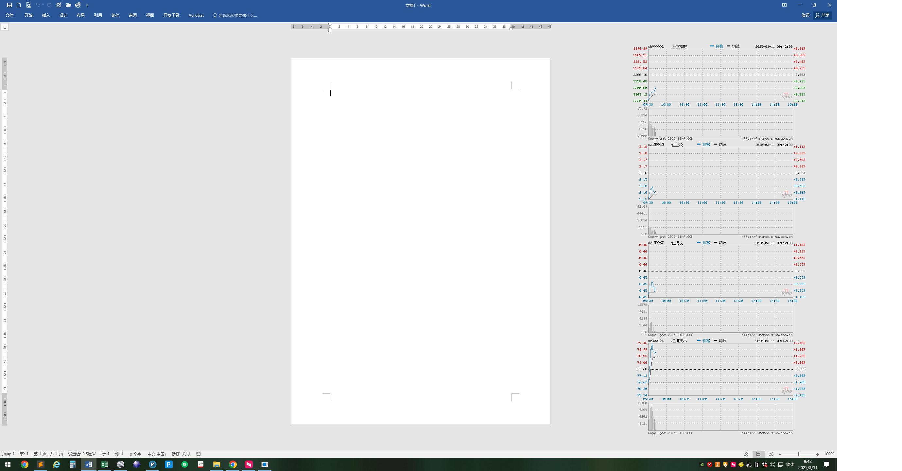
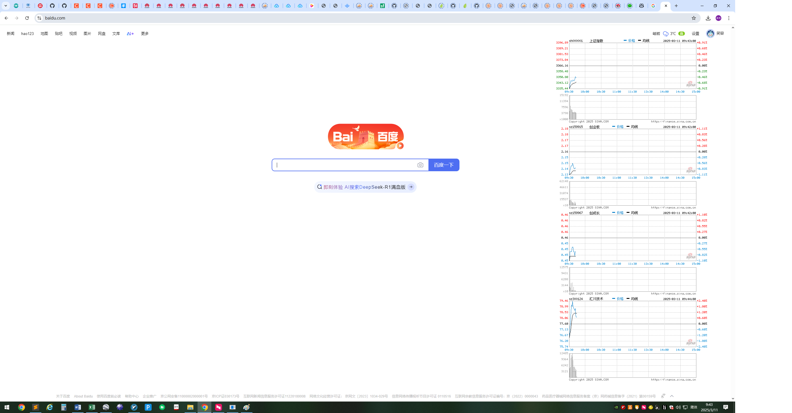

# stockviewer
摸鱼股票助手

## 编译指令： 

clang++ -std=c++17 -o stockviewer.exe main.cpp -lgdiplus -lwininet -luser32 -lgdi32 -lole32

## 配置文件：

```json
{
    "base_url": "https://image.sinajs.cn/newchart/min/n/{stock_id}.png", // 图片地址模板 目前只支持 png格式的
    "referer": "https://quotes.sina.cn/", // referer
    "stock_list": [ // 关注的股票列表
        "sh000001",
        "sz159915",
        "sz159967",
        "sz300124"
    ],
    "window_position": { // 记忆窗口位置
        "x": 1815,
        "y": 135
    }
}
```

## 屏幕快照

snapshot 1



snapshot 2



## 开发计划

希望有空的可以：

* 增加隐藏快捷键
* 增加只显示第一只的快捷键
* 增加背景透明度调整功能
